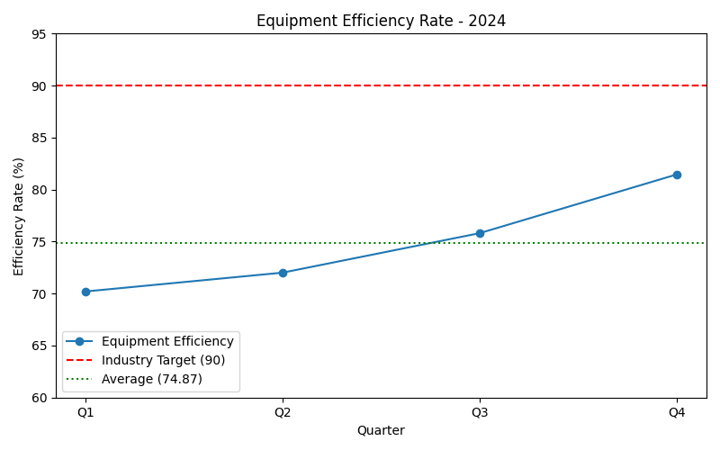

# Manufacturing Performance Analysis

**Email:** 24f1001581@ds.study.iitm.ac.in

## Dataset
- Q1: 70.2
- Q2: 72.01
- Q3: 75.81
- Q4: 81.46
- **Average Efficiency:** 74.87  
- **Industry Target:** 90  

## Key Findings
- Equipment efficiency is **below the industry target (90)** in every quarter.
- Efficiency improved from **70.2 in Q1 → 81.46 in Q4**, showing a positive upward trend.
- The **current average (74.87)** is still significantly below the target of 90.
- Maintenance costs and downtime are increasing, threatening profitability.

## Business Implications
- Failure to close the gap risks:
  - Higher production delays  
  - Increased maintenance costs  
  - Loss of competitiveness compared to peers meeting 90+ efficiency  

## Recommendations
To reach the industry target of 90, the company should:
1. **Implement a predictive maintenance program** (AI/IoT-based sensors to forecast failures before downtime).  
2. Optimize resource allocation toward preventive care.  
3. Track quarterly improvements and benchmark regularly.  

## Visualization

---
